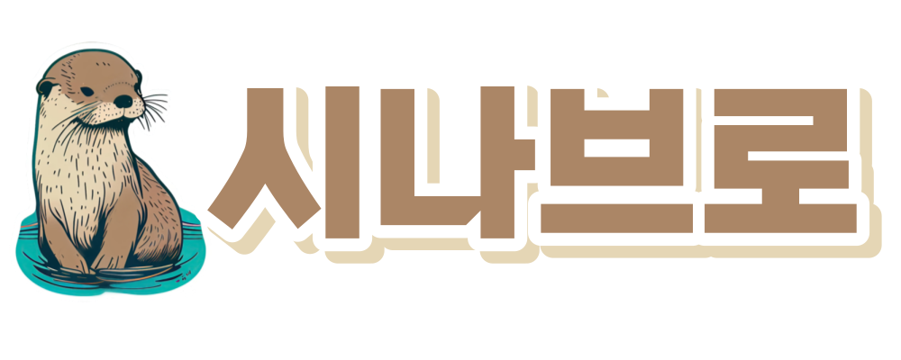

# 시나브로

### **멸종 위기 동물에 대한 데이터 분석 및 인사이트 웹사이트**

 

## 1. 프로젝트 구성 안내

 

- 서비스 명 : 시나브로

- 개발 기간 : 2023.06.05 ~ 2023.06.23

- 주제 : 멸종 위기 동물에 대한 데이터 분석 및 인사이트

- 목표 : 멸종 위기 동물에 대해 관심이 없는 일반인들에게 사태의 심각성을 알리고 관심도 증가시키기

- 배포 페이지 : [바로 가기](http://kdt-ai7-team01.elicecoding.com)

- API문서 : [바로 가기](http://kdt-ai7-team01.elicecoding.com/api/docs)

 

## 2. 프로젝트 소개

 

### 📊 사용한 데이터

 

#### 데이터 수집은 주로 공공데이터 포털과 국립 생태원을 통해 이뤄졌습니다.

#### 이번 프로젝트에서 사용한 데이터는 한국의 멸종위기종 분포, 국립공원 지정 현황, 생태통로 위치, 지역별 멸종위기종 분포를 사용하였으며, 필요에 따라 이 데이터들을 가공하여 사용하였습니다.

#### 각각의 데이터는 지역별 분포, 각 데이터간의 상관관계, 연도별 상황을 나타내기 위해 활용되었습니다.

#### 연도별 멸종위기종 변화

 

### 🔧 기술 스택

#### 프론트엔드

 

#### 백엔드

 

#### 데이터 분석

 

## 3. 프로젝트 목표

**데이터 분석 결과로 도출되는 인사이트와 웹서비스의 해결과제에 대한 논의 (50자 이상)**

- 프로젝트 아이디어 동기
- 문제를 해결하기 위한 특정 질문 명시
- 데이터를 통해 탐색하려는 문제를 구체적으로 작성

## 4. 프로젝트 기능 설명

**웹서비스의 유용성, 편의성 및 시각화의 실용성에 대한 설명**

- 주요 기능 (주된 활용성) 및 서브 기능
- 프로젝트만의 차별점, 기대 효과

## 5. 프로젝트 구성도

- 와이어프레임/스토리보드 추가

## 6. 프로젝트 팀원 역할 분담

| 이름   | 담당 업무        |
| ------ | ---------------- |
| 방석진 | 팀장/데이터 분석 |
| 이지윤 | 프론트엔드 개발  |
| 황준성 | 프론트엔드 개발  |
| 이채영 | 프론트엔드 개발  |
| 이승현 | 백엔드 개발      |

**파트별 responsibility**

1. 데이터 담당

- 기획 단계: 구체적인 설계와 지표에 따른 프로젝트 제안서 작성
- 개발 단계: 팀원간의 일정 등 조율 + 프론트 or 백엔드 개발
- 수정 단계: 기획, 스크럼 진행, 코치님 피드백 반영해서 수정, 발표 준비

2. 프론트엔드

- 기획 단계: 큰 주제에서 문제 해결 아이디어 도출, 데이터 수집, 와이어프레임 작성
- 개발 단계: 와이어프레임을 기반으로 구현, 데이터 처리 및 시각화 담당, UI 디자인 완성
- 수정 단계: 피드백 반영해서 프론트 디자인 수정

3.  백엔드

- 기획 단계: 기획 데이터 분석을 통해 해결하고자 하는 문제를 정의
- 개발 단계: 웹 서버 사용자가 직접 백엔드에 저장할수 있는 기능 구현, 데이터 베이스 구축 및 API 활용, 데이터 분석 개념 총동원하기
- 수정 단계: 코치님 피드백 반영해서 분석/ 시각화 방식 수정

## 7. 버전

- 프로젝트의 버전 기입

## 8. FAQ

- 자주 받는 질문 정리
